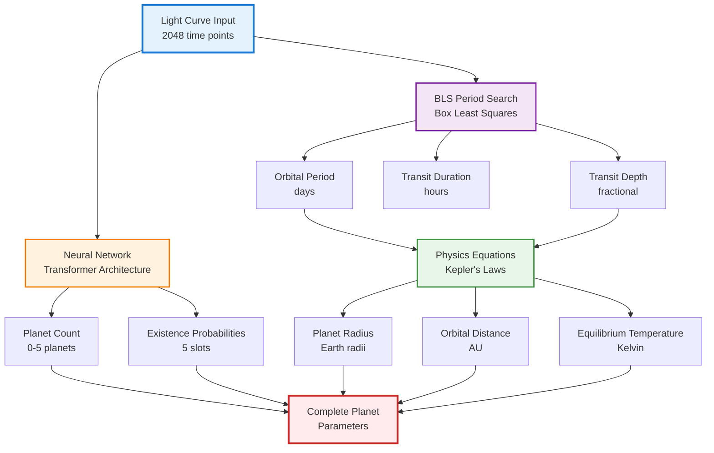
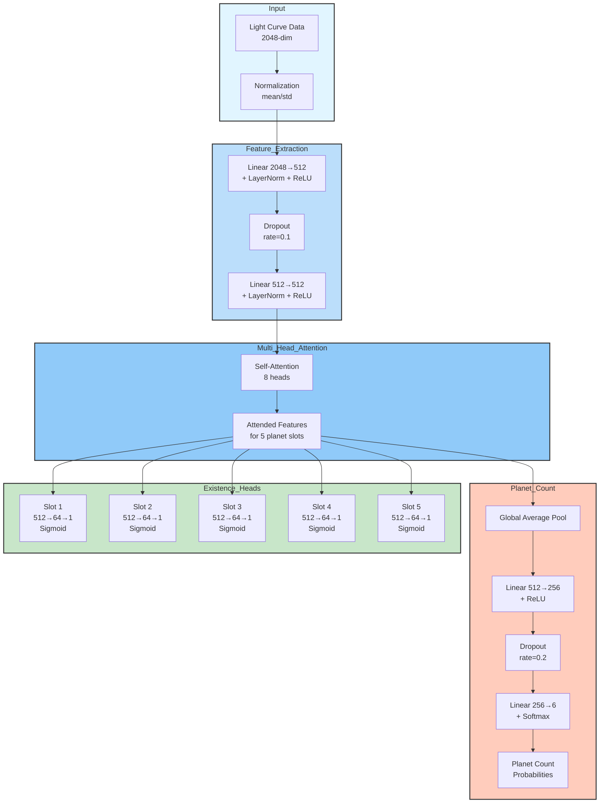

# HERMES - Hybrid Exoplanet Recognition and Multi-planet Extraction System

[](https://www.python.org/downloads/)
[](https://github.com/google/jax)
[](https://opensource.org/licenses/MIT)

**HERMES** is a fast, accurate exoplanet detection system that combines neural networks with physics-based analysis to identify and characterize multiple planets from stellar light curves. Named after the fastest messenger of the Olympian gods, HERMES achieves inference speeds of ~7ms per light curve while maintaining scientific rigor through its hybrid architecture.

---

## Why HERMES?

### The Challenge

Traditional exoplanet detection is a time-intensive process. Astronomers must manually examine light curves—time-series measurements of a star's brightness—looking for tiny, periodic dips that indicate a planet passing in front of its host star (a transit). For each potential planet, they must:

1. **Identify** whether a signal is truly a planet or just noise
2. **Measure** transit depth, duration, and period from the light curve
3. **Calculate** physical parameters (planet radius, orbital distance) using astrophysical equations
4. **Validate** that the measurements are physically consistent

This process can take hours per light curve. With missions like Kepler and TESS producing millions of light curves, manual analysis becomes infeasible.

### Our Solution

HERMES automates this entire pipeline while maintaining scientific accuracy:

- **Rapid Detection**: Analyzes thousands of light curves in seconds
- **Multi-Planet Systems**: Detects up to 5 planets in a single system simultaneously
- **Physics-Grounded**: Uses established astrophysical laws (Kepler's laws, transit geometry) rather than pure neural network predictions
- **Complete Characterization**: Outputs planet count, orbital periods, radii, distances, and confidence scores

By combining the pattern recognition capabilities of neural networks with the precision of physics-based computation, HERMES enables astronomers to quickly triage large datasets and focus their attention on the most promising candidates.

---

## Quick Start

### Installation

> **Note**: A pre-trained model will be available on [🤗 HuggingFace](https://huggingface.co) soon for immediate inference without local training.

For local development and training:

```bash
# Clone the repository
git clone https://github.com/OrryxTeam/hermes.git
cd hermes

# Create and activate virtual environment
python3 -m venv .venv
source .venv/bin/activate

# Install dependencies
pip install -r requirements.txt
```

### Running Inference

```bash
# Run inference on a light curve CSV file
python test.py --input_csv your_lightcurve.csv --output predictions.json

# With a specific checkpoint
python test.py --checkpoint outputs/run_*/checkpoints/checkpoint_500.npz \
               --input_csv data.csv --output results.json
```

**Input Format** (CSV):
```csv
time,flux,flux_err
0.0,1.0001,0.0001
0.1,0.9998,0.0001
0.2,0.9995,0.0002
...
```

**Output Format** (JSON):
```json
{
  "predicted_planet_count": 2,
  "planet_count_confidence": 0.87,
  "planets": [
    {
      "planet_id": 1,
      "orbital_period_days": 10.2,
      "planet_radius_earth": 1.3,
      "orbital_distance_au": 0.1,
      "equilibrium_temperature_k": 1200,
      "confidence_score": 0.92
    }
  ]
}
```

---

## Architecture

### Hybrid Approach: Neural Network + Physics

HERMES uses a **hybrid architecture** that combines the strengths of machine learning with established astrophysical equations. This design choice is fundamental: neural networks excel at pattern recognition but cannot "learn" physical laws better than we already know them.



### Neural Network Architecture

The neural network is responsible for **detection** and **classification** tasks:



**Key Components:**

1. **Input Normalization**: Standardizes light curves to zero mean and unit variance
2. **Feature Encoder**: Two-layer MLP with LayerNorm extracts high-level features (2048→512→512)
3. **Multi-Head Attention**: 8-head self-attention creates 5 "planet slots" using positional encodings
4. **Planet Count Head**: Global pooling + classification predicts total number of planets (0-5)
5. **Existence Heads**: 5 separate binary classifiers determine if each slot contains a real planet

### Physics-Based Parameter Computation

Rather than having the neural network directly predict physical parameters (which would be unreliable), HERMES computes them using established astrophysical methods:

**1. Box Least Squares (BLS) Period Search**
```python
# BLS finds periodic transit signals in the light curve
bls = BoxLeastSquares(time, flux, flux_err)
periodogram = bls.power(periods, durations)
→ period, transit_depth, transit_duration, SNR
```

**2. Kepler's Third Law (Orbital Distance)**
```python
# For a solar-mass star:
# a³/P² = GM☉/(4π²)
a [AU] = (P [years])^(2/3)
```

**3. Transit Geometry (Planet Radius)**
```python
# Transit depth δ = (R_planet/R_star)²
R_planet = R_star × √δ
```

**4. Equilibrium Temperature**
```python
# Energy balance equation:
T_eq = T_star × √(R_star/2a) × (1-A)^0.25
# where A is the Bond albedo
```

### Why This Hybrid Approach?

| Aspect | Pure Neural Network | Hybrid (HERMES) |
|--------|-------------------|-----------------|
| **Period Detection** | Regression (unreliable) | BLS signal processing (accurate) |
| **Physical Consistency** | No guarantees | Enforced by Kepler's laws |
| **Interpretability** | Black box | Transparent physics |
| **Generalization** | Limited to training data | Physics always holds |
| **Speed** | ~7ms | ~7ms (comparable) |

---

## Project Structure

```
hermes/
├── train.py                      # Training entry point
├── eval.py                       # Evaluation entry point
├── infer.py                      # Inference entry point
├── test.py                       # Quick inference testing
├── configs/
│   └── default.gin               # All hyperparameters (Gin config)
├── hermes/                       # Core package
│   ├── model.py                  # Neural network architecture
│   ├── trainer.py                # Training loop + checkpointing
│   ├── data.py                   # TensorFlow Datasets loader
│   ├── koi_data_loader.py        # Kepler Objects of Interest loader
│   ├── signal_analysis.py        # BLS period search implementation
│   ├── physics.py                # Astrophysical equations
│   └── infer.py                  # Inference combining NN + BLS + physics
├── dataset/                      # Kepler light curve data
│   └── kepler_test/              # Preprocessed test dataset
├── outputs/                      # Training runs (checkpoints, logs)
└── requirements.txt              # Python dependencies
```

---

## Training Details

### Dataset

HERMES is trained on light curves from NASA's [Kepler mission](https://www.nasa.gov/mission_pages/kepler/main/index.html), specifically:
- **Kepler Objects of Interest (KOIs)**: Candidate exoplanet systems
- **Light curve length**: 2048 time points (uniformly sampled)
- **Multi-planet systems**: Up to 5 confirmed planets per system
- **Augmentation**: None required (real observational data)

### Loss Function

The model uses a composite loss that balances multiple objectives:

```python
total_loss = λ₁·count_loss + λ₂·existence_loss

where:
  count_loss = CrossEntropy(predicted_count, true_count)
  existence_loss = Σ BinaryCrossEntropy(existence_prob_i, true_existence_i)
```

No loss is computed for physical parameters since they're derived from BLS and physics.

### Training Configuration

Key hyperparameters (defined in `configs/default.gin`):

```python
train.num_epochs = 100
train.batch_size = 32
create_optimizer.learning_rate = 1e-4
MultiPlanetDetector.hidden_dim = 512
MultiPlanetDetector.num_attention_heads = 8
MultiPlanetDetector.dropout_rate = 0.1
```
---

## Contributing

We welcome contributions! Whether you want to improve the model, add new features, or fix bugs, here's how to get started.

### Local Development Setup

```bash
# Clone and create environment (see Quick Start above)
git clone https://github.com//hermes.git
cd hermes
python3 -m venv .venv
source .venv/bin/activate
pip install -r requirements.txt
```

### Training from Scratch

```bash
# Train with default configuration
python train.py --config configs/default.gin

# Train with custom dataset path
python train.py --config configs/default.gin --dataset_dir /path/to/kepler/data

# Training outputs are saved to outputs/run_YYYYMMDD_HHMMSS/
#   ├── checkpoints/          # Model checkpoints (.npz files)
#   ├── logs/                 # TensorBoard logs
#   ├── metadata.json         # Run metadata
#   └── operative_config.gin  # Exact config used for this run
```

### Evaluation

```bash
# Evaluate a trained checkpoint
python eval.py --config configs/default.gin \
               --checkpoint outputs/run_20251005_025812/checkpoints/checkpoint_500.npz
```

### Configuration Management

HERMES uses [Gin Config](https://github.com/google/gin-config) for hyperparameter management:

- **DO NOT** pass hyperparameters via command-line flags
- **DO** edit `configs/default.gin` to modify settings
- All configuration is versioned and saved with each training run

Example `default.gin` modification:
```python
# Change model architecture
MultiPlanetDetector.hidden_dim = 1024  # Increase model capacity
MultiPlanetDetector.num_attention_heads = 16

# Adjust training
train.num_epochs = 200
create_optimizer.learning_rate = 5e-5
```

### Code Style

This project follows the [Google Python Style Guide](https://google.github.io/styleguide/pyguide.html). Key conventions:

- **Type hints**: All function signatures include types
- **Docstrings**: Google-style docstrings for all public functions
- **JAX patterns**: Use `jax.numpy`, avoid in-place operations, JIT-compile pure functions
- **Flax NNX**: Use `nnx.Module` for neural network components

### Running Tests

```bash
# Test full pipeline on synthetic data
python test_full_pipeline.py

# Test KOI data loader
python test_koi_loader.py

# Test inference
python inference_test.py
```

---

## Roadmap

### Coming Soon

- **🤗 HuggingFace Integration**: Pre-trained models for immediate inference
- **Web Interface**: Interactive visualization of detected planets (UI repository: *coming soon*)
- **API Endpoint**: REST API for programmatic access
- **Extended Physics**: Inclination estimation, eccentricity detection
- **Larger Models**: Scaling to 6+ planet systems

### Future Research Directions

- **False Positive Filtering**: Better discrimination of astrophysical false positives (eclipsing binaries, stellar activity)
- **Transfer Learning**: Adapt to TESS, PLATO, and other mission data
- **Uncertainty Quantification**: Bayesian neural networks for confidence intervals
- **Active Learning**: Suggest which observations would most improve the model

---

## Citation

If you use HERMES in your research, please cite:

```bibtex
@software{hermes2024,
  author = {Your Name},
  title = {HERMES: Hybrid Exoplanet Recognition and Multi-planet Extraction System},
  year = {2024},
  url = {https://github.com/yourusername/hermes}
}
```

---

## License

This project is licensed under the MIT License - see the [LICENSE](LICENSE) file for details.

---

## Acknowledgments

- **NASA Kepler Mission**: For providing the light curve data
- **Astropy**: For the Box Least Squares implementation
- **Google JAX/Flax**: For the high-performance ML framework
- **Gin Config**: For elegant configuration management

---

<div align="center">
  <p><i>Detecting worlds beyond our own, one light curve at a time.</i></p>
  <p>⭐ If you find this project useful, please consider giving it a star!</p>
</div>
